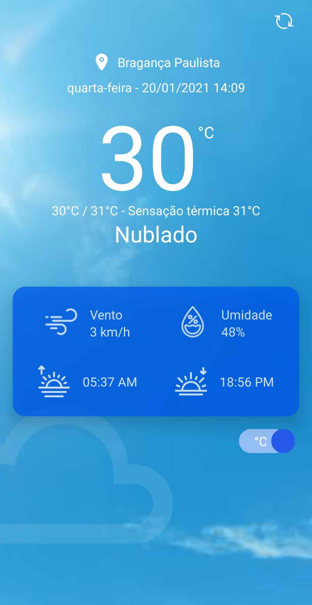
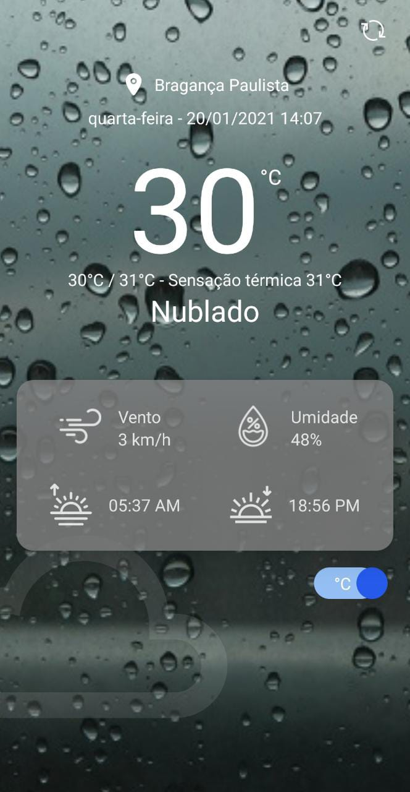
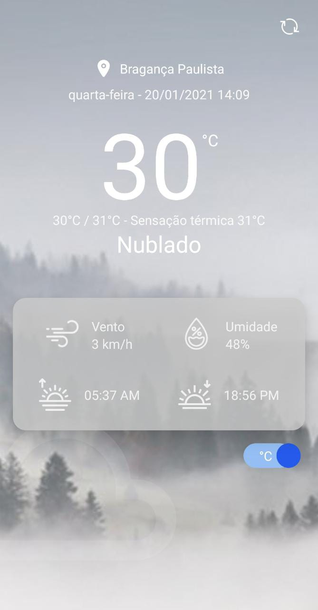

# 📝 Introdução
Aplicação de Clima que mostra os dados da localização atual do usuário, bem como sua cidade, data, hora e as informações de temperatura. Podendo escolher entre graus Celcius ou Fahrenheit. Para que seus dados sejam exibidos na tela é necessário a permissão de acesso a localização atual do dispositivo móvel.

<br/>

# 🏁 Iniciando o projeto
````zsh
# Clonar o projeto
$ git clone https://github.com/leopacciulli/WeatherApp.git

# Acessar a pasta
$ cd WeatherApp

# Instalar as depêndencias
$ yarn

# Iniciar o servidor do Expo
$ yarn expo:android | yarn expo:ios
````
<div align="center">
  
  
  
</div>

<br/>

# 📂 Arquitetura / Estrutura de pastas
- O projeto foi criado utilizando `yarn create react-native-app WeatherApp` (React Native / Hooks), rodando com Expo inserindo no package.json os seguintes comando em scripts: "expo:android": "expo start --android" e "expo:ios": "expo start --ios".
- Para utilização do Typescript foi instalado com o seguinte comando: `yarn add --dev typescript @types/react @types/react-native @types/react-dom`.
- A estrutura de pastas foram distríbuidas dentro de `src`: <br/>
`src/assets`: imagens e ícones; <br/>
`src/components`: componentes que foram separados para uma melhor estrutura/manutenção/usabilidade; <br/>
`src/pages`: tela inicial do projeto; <br/>
`src/service`: armazenamento onde ocorrem as chamadas às API's; <br/>
`src/utils`: utilidades/funcionalidades utilizadas

<br/>

# 🛠 Bibliotecas / Api
- A localização do usuário foi obtida através da `expo-location`, onde é requisitado ao usuário que permita o acesso a localização retornando assim a latidude e longitude atual.
- Data e hora foi obtida através da utilização do `moment.js`, realizando a formatação para uso local.
- É possível alterar as medidas de unidades da temperatura pressionando o Switch, sendo utilizada a biblioteca `react-native-switch`.
- Utilizado `axios` para realização das chamadas as API's.
- Os ícones foram obtidos através da biblioteca `@expo/vector-icons`, consulte: https://icons.expo.fyi/
- As informações de clima foi obtida através da API `openweathermap.org/api`, nela é possível realizar requests limitadas mensalmente, basta se cadastrar e gerar uma API_Key que é guardada em `src/utils/ApiKey.ts`.

<br/>